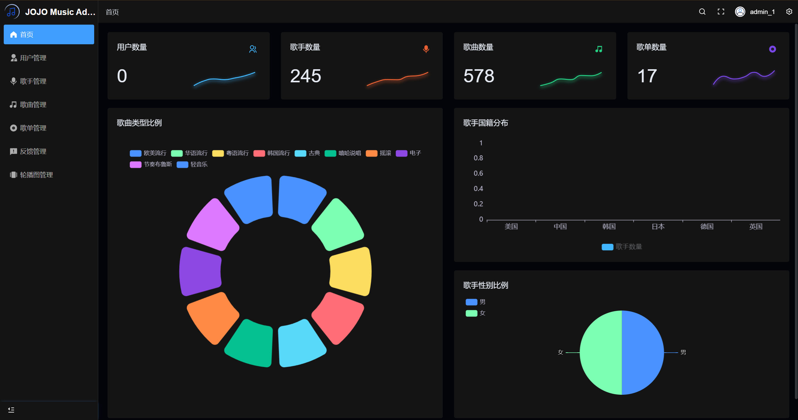
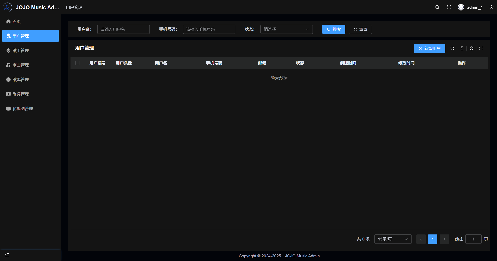
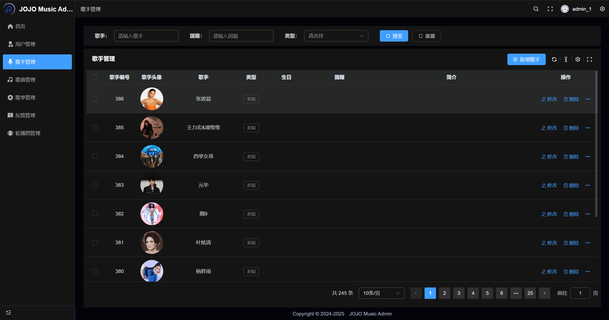
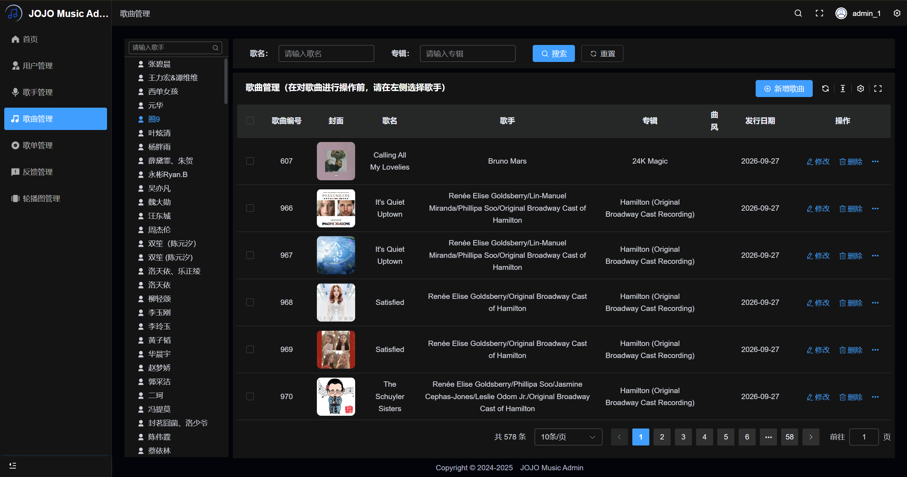
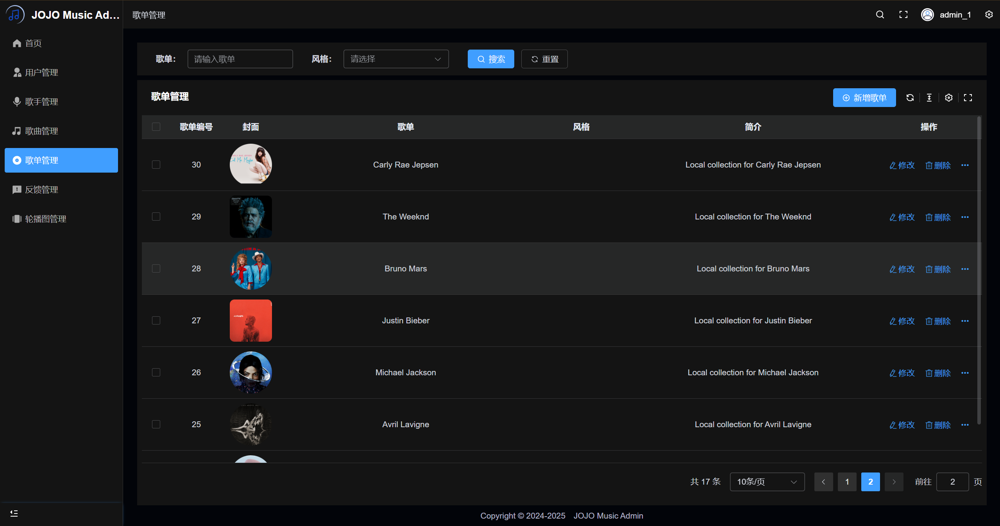
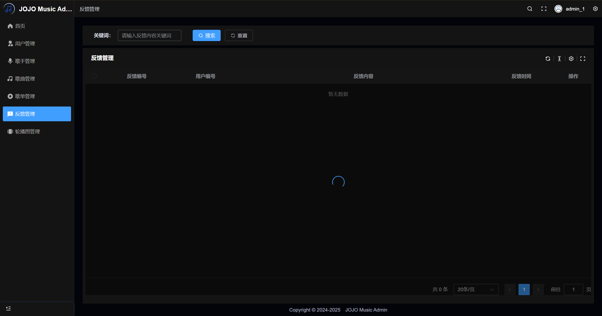
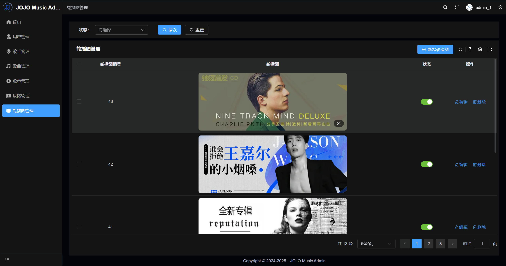

# JOJO MUSIC Admin 💻

## 项目简介

**JOJO MUSIC Admin** 是 JOJO MUSIC 平台的后台管理系统，面向音乐内容管理、用户管理、歌单管理和系统运营场景。

本项目基于 **Vue 3 + Vite + TypeScript + Pinia + Element Plus + Tailwind CSS** 构建，主要用于管理歌手、歌曲、歌单、用户、反馈和首页内容。

## 主要功能

- 用户管理：查看、启用/禁用用户账号
- 歌手管理：新增、编辑、删除歌手资料
- 歌曲管理：管理歌曲信息与资源
- 歌单管理：创建、编辑、删除歌单
- 反馈管理：查看用户反馈与处理记录
- 轮播图管理：维护首页展示内容

## 技术栈

- Vue 3
- Vite
- TypeScript
- Pinia
- Element Plus
- Tailwind CSS
- pnpm

## 系统要求

- Node.js >= 18
- pnpm >= 9

## 仓库地址

- GitHub: https://github.com/timi669/jojo-music-admin
- Client: https://github.com/timi669/jojo-music-client
- Server: https://github.com/timi669/jojo-music-server

## 安装与运行

1. 克隆项目

   ```bash
   git clone https://github.com/timi669/jojo-music-admin.git
   cd jojo-music-admin
   ```

2. 安装依赖

   ```bash
   pnpm install
   ```

3. 配置环境变量

   - 复制 `.env.development` 或新建 `.env.development.local`
   - 设置 `VITE_APP_BASE_API` 为你本地或部署后的后端地址，例如：

   ```env
   VITE_APP_BASE_API=http://localhost:8080
   ```

4. 启动开发模式

   ```bash
   pnpm dev
   ```

5. 构建生产版本

   ```bash
   pnpm build
   ```

6. 预览构建结果

   ```bash
   pnpm preview
   ```

## 项目脚本

- `pnpm dev`：启动开发服务器
- `pnpm build`：构建生产包
- `pnpm preview`：本地预览生产构建
- `pnpm lint`：代码检查
- `pnpm format`：格式化代码
- `pnpm type-check`：TypeScript 类型检查

## 项目截图










## 依赖后端服务

本项目依赖 JOJO MUSIC Server 提供数据接口与业务逻辑，使用前请确保后端已成功启动并可访问。

- 后端仓库：https://github.com/timi669/jojo-music-server

## 版权与免责声明

本项目仅供学习、研究和个人技术实践使用。

- 请勿用于任何违法、侵权或商业用途。
- 音乐内容、用户数据和资源必须来自你自行部署的后端服务与合法授权来源。
- 因使用本项目产生的任何后果，由使用者自行承担，作者不承担责任。

在使用前，请确认你已合法拥有并控制相关数据来源与服务部署环境。

## 许可证

本项目遵循 MIT 许可证，详情请查看 [LICENSE](LICENSE)。

## 贡献

欢迎提出 Issue、Pull Request 或改进建议，帮助完善 JOJO MUSIC Admin。
